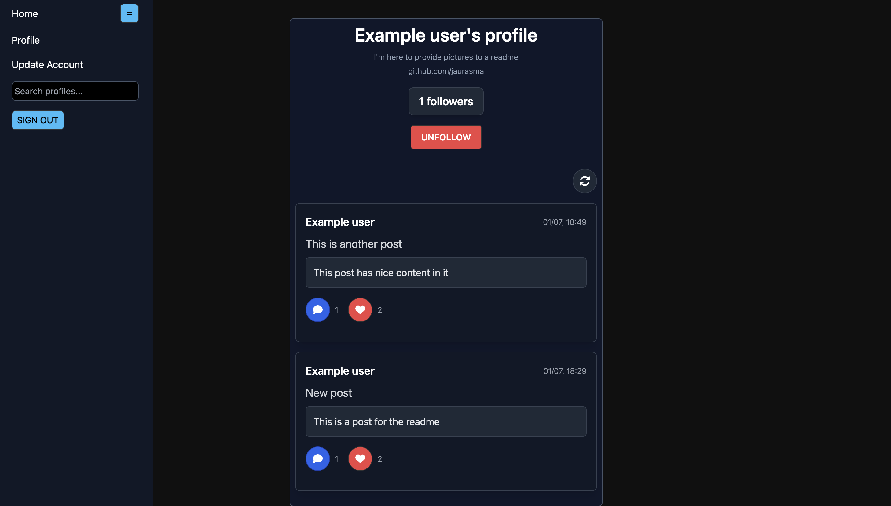

# socialcraze - Simple Social Media Site
*This project was developed in collaboration with [Aki Falck](https://github.com/AkiFalck).*
## Overview

This project is a simple social media site built using Next.js and Supabase. The application allows users to view profiles, follow and unfollow users, and see a list of posts made by users. It features a clean user interface and smooth animations to enhance user experience.

## Features

- **User Profiles**: View detailed user profiles including their bio and website.
- **Follow/Unfollow Functionality**: Follow or unfollow users with animated feedback.
- **Posts**: Display a list of user posts with likes and comments.
- **Real-time Updates**: Real-time follower count updates with animations.
- **Responsive Design**: Optimized for both desktop and mobile devices.

## Technologies Used

- **Next.js**: A React framework for building server-side rendered and statically generated web applications.
- **Supabase**: An open-source Firebase alternative that provides a real-time database and authentication services.
- **Tailwind CSS**: A utility-first CSS framework for styling the application.
- **FontAwesome**: An icon library used for the refresh and follow/unfollow icons.
## Screenshots
### Home Page

### Profile viewer

### Own profile

